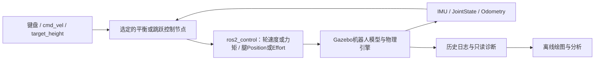
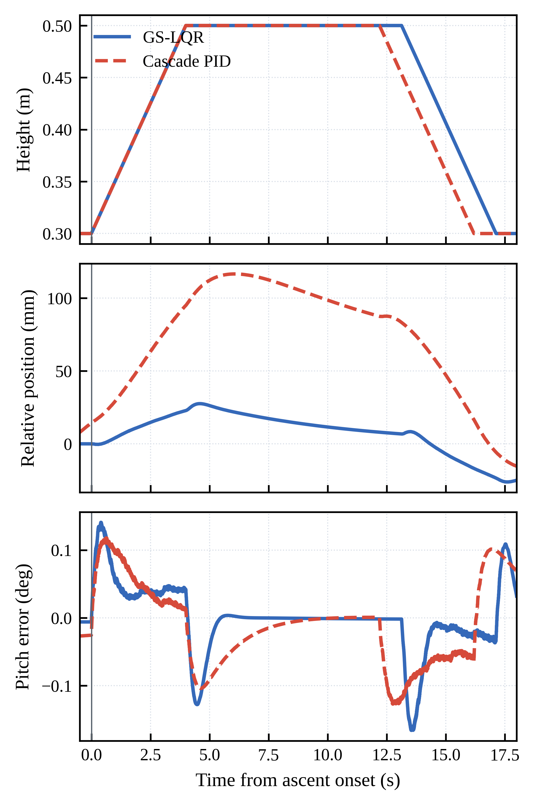

# BBot 双轮足机器人控制与仿真

基于 **ROS 2 Iron + Gazebo Sim / Ignition Fortress** 的双轮双腿机器人工作区。项目包含平衡与运动控制、可变站立高度、第一代平地跳跃，以及 CAN 电机驱动和 CRSF 遥控接收模块。

机器人使用左右轮移动和平衡、四个髋膝关节调整腿部构型。模型、控制器、执行接口与离线分析工具均保留在同一工作区。当前第一代跳跃已能完成腾空、落地并恢复 BALANCE，但净空和落地后退仍有明显局限；独立 landing-repair 候选尚未通过物理准入，不能视为已修复。

[技术文档](docs/README.md) · [平衡控制](docs/balance/README.md) · [第一代跳跃总结](docs/jump_controller_v1/README.md) · [实验结果](docs/jump_controller_v1/EXPERIMENTS.md) · [发布准备清单](docs/RELEASE_PREPARATION.md)

## 模型与执行结构

[机器人模型](src/bbot_description/urdf/bbot.urdf.xacro)包含 CAD 网格、质量惯量、关节限制、IMU、里程计及 `gz_ros2_control` 接口；[运动学库](src/bbot_kinematics/)提供腿部逆解、雅可比和重力计算。[仿真入口](src/bbot_bringup/launch/bbot_gazebo.launch.py)负责加载世界、生成机器人、建立 ROS/Gazebo 桥并选择控制器。



每次应由选定入口占用控制接口。不同算法是可选运行方式，不能同时向相同轮腿接口发布控制命令。

## 平衡、运动与变高度

统一通过 `controller_type` 选择；下表表示源码、构建目标及 launch 分支存在，不等于每种方式都完成同等级的性能验收。

| 入口 | 实际控制方式 | 状态与使用范围 |
|---|---|---|
| `pid` | 速度级串级 PID，速度、姿态与角速度反馈，经差速控制器输出轮速 | 正式可选入口；[源码与说明](src/bbot_balance_controller/src/README_PID.md) |
| `torque_cascade_pid`（别名 `torque_pid`） | 直接轮力矩的高度调度串级 PID | 正式可选入口；已有 PID/GS-LQR 对照资料 |
| `position_torque_cascade_pid` | 位置误差参与串级轮力矩控制 | 正式可选入口，属于位置控制研究路径，不宣称全工况验收 |
| `lqr` | 状态反馈生成轮速度参考；当前代码也按高度插值两组增益 | 正式可选入口，不能简单称为全程固定增益；[方法说明](src/bbot_balance_controller/src/README_LQR.md) |
| `gs_lqr` | 根据腿高调度状态反馈增益，直接轮力矩输出 | 正式可选入口，有变高度和扰动对照；[方法说明](src/bbot_balance_controller/src/README_LQR_gain_scheduled.md) |
| `adaptive_lqr` | Gain-Scheduled LQR + 慢速等效COM偏置/平衡点估计；带更新门及两级位置控制 | 正式可选入口，已有偏置和位置实验；“自适应”不表示任意在线学习全部增益；[方法说明](src/bbot_balance_controller/src/README_adaptive_LQR.md) |
| `mpc` | 高度更新的线性模型、有限预测时域和约束QP；DARE终端代价 | 正式可选入口；[实现说明](src/bbot_balance_controller/src/README_MPC.md)与[配置](src/bbot_balance_controller/config/mpc_balance_params.yaml)，不以求解器存在代替物理验收 |
| `gs_lqr_historical` | 使用自适应节点的历史 nominal 对照配置 | 历史实验入口，不作为日常推荐 |

固定增益对照可见自适应节点的 `adaptive_gain_mode:=fixed_midpoint`；通常使用 `scheduled`。这与 `lqr` 入口不是同一个实现。

运动请求主要通过 `/cmd_vel`（`geometry_msgs/msg/Twist`），变高度通过 `/target_height`（`std_msgs/msg/Float64`）；支持情况、范围、平滑和位置保持策略以所选节点为准。腿部高度通过平滑轨迹与IK改变构型，轮端同时维持平衡；位置控制、速度跟踪及偏置估计不能相互混作同一功能。

已有变高度对照图（历史实验条件下的高度、相对位置与pitch误差，不代表所有算法统一排名）：



图来自仓库已有 `figures/`，没有重新生成实验结果。更多配置、源码与历史说明见[平衡文档](docs/balance/README.md)。

## 第一代平地跳跃

当前 launch 默认选择 `jump_velocity`，对应 [bbot_velocity_jump_controller.cpp](src/bbot_balance_controller/src/bbot_velocity_jump_controller.cpp)。同一节点集成跳前平衡、高度调整、推地、飞行、落地与恢复。经典 `jump` 是另一个实现；reference、landing-repair 与 contact-motion 等属于独立候选或实验路径。


首次跳跃的准备/下蹲主要使用腿Position接口；THRUST等待控制器切换成功后使用Effort，飞行、缓冲和默认恢复继续Effort，跳后BALANCE也可保持Effort支撑。不能仅由状态名判断模式。核心算法包括竖直COM速度反馈推力、有界五次关节轨迹、隐式关节PD、落地弹簧阻尼支撑和COM捕获律。详细状态门、保护及公式见[第一代技术总结](docs/jump_controller_v1/README.md)。

历史稳定基线 `jump_height=0.25 / takeoff_velocity=0.0 / thrust_release_velocity_ratio=0.78 / landing_capture_gain=1.60` 的 B1/B2/B3 已有物理结果：

| 指标 | 已有稳定基线范围 |
|---|---:|
| 原生COM离地竖直速度 | 2.155～2.200 m/s |
| COM相对真实离地最大上升 | 23.43～24.40 cm |
| 双轮同帧最大轮底净空 | **15.03～16.56 cm** |
| 首触后最大轮轴后退 | **42.76～47.67 cm** |
| 首触后20秒轮轴相对位置 | −6.60～−2.70 cm |
| 首触至回到BALANCE | 4.65～4.69 s |

数据和口径见[实验总表](docs/jump_controller_v1/EXPERIMENTS.md)。`jump_height`不是实测净空；失败高跳约23.96 cm不属于稳定性能。20 cm净空与少后退目标尚未达到，空中收腿、浮基耦合及落地捕获存在限制。修复候选当前为 `NO_PHYSICAL_ADMISSION`，见[原状态与验收入口](LANDING_REPAIR.md)。

## 环境、编译与启动

当前工作机核实环境为 Ubuntu **22.04.5 LTS**、ROS **2 Iron**、Ignition Gazebo **6.18.0（Fortress）**，`ros_gz_bridge` / `ros_gz_sim` 包版本 **0.254.2**；这是已使用环境记录，不保证其他ROS/Gazebo组合兼容。

主要依赖：ament/colcon、C++17、Eigen3、xacro、robot_state_publisher、ROS消息与tf2、ros_gz桥、ros2_control/controller_manager、diff_drive_controller、joint_state_broadcaster和 `gz_ros2_control`。原生记录插件还要求 ignition-gazebo6、plugin1、transport11、msgs8开发库，见[bringup构建声明](src/bbot_bringup/CMakeLists.txt)。Python离线绘图需要NumPy和Matplotlib，角动量工具只使用标准库；CRSF串口模块另需其串口依赖。

在上述依赖已安装的环境中：

```bash
cd ~/bbot_ws_new
source /opt/ros/iron/setup.bash
colcon build --symlink-install
source setup_env.sh
```

`setup_env.sh`要求工作区已经构建，并加载本机可选 `opt_ros/` 插件补充路径。这个目录不随Git发布；干净机器仍需安装匹配的 `gz_ros2_control` 及开发依赖，不能把本地安装产物当作源码依赖已解决。详见[环境与仿真调试手册](docs/BBOT_SIMULATION_DEBUG_MANUAL.md)。本次发布准备没有重新构建或运行仿真。

平衡仿真示例：

```bash
ros2 launch bbot_bringup bbot_gazebo.launch.py controller_type:=adaptive_lqr
# 其他方式替换 controller_type，如 gs_lqr、pid、mpc
```

默认velocity跳跃示例（显式给出历史基线的launch参数，不修改仓库默认值）：

```bash
ros2 launch bbot_bringup bbot_gazebo.launch.py controller_type:=jump_velocity jump_height:=0.25 takeoff_velocity:=0.0 thrust_release_velocity_ratio:=0.78
```

站立稳定后按 J，或另一个已加载相同ROS环境的终端发送：

```bash
ros2 topic pub --once /jump_cmd std_msgs/msg/String '{data: jump}'
```

请求仍须通过控制器状态/数据/姿态门；节点默认 `landing_capture_gain=1.60`，完整参数与launch覆盖关系见[76项参数索引](docs/jump_controller_v1/PARAMETERS.md)。自动演示脚本 [run_complete_jump_demo.sh](run_complete_jump_demo.sh) 会启动真实仿真并请求**两次跳跃**，不是只读绘图工具；本轮未执行。

## 功能包与目录

| 路径 | 职责 |
|---|---|
| `src/bbot_balance_controller/` | PID、LQR、MPC、变高度和跳跃节点，共享模型/保护、脚本与测试 |
| `src/bbot_bringup/` | 正式launch、ros2_control配置、Gazebo世界及记录插件 |
| `src/bbot_description/` | xacro/URDF、CAD网格、关节与执行接口 |
| `src/bbot_kinematics/` | 腿部IK、雅可比、重力与几何模型 |
| `src/bbot_motor_driver/` | SocketCAN电机驱动节点与协议封装 |
| `src/bbot_rc_receiver/` | CRSF串口接收、遥控通道发布和遥测代码 |
| `src/bbot_torque_control/` | 独立高度控制、力矩监测及launch |
| `experiments/jump/` | 独立候选、历史报告及实验导航，不等于默认运行路径 |
| `experiments/jump/tools/` | 已迁移的通用绘图和角动量分析实现，旧位置保留兼容入口 |
| `docs/`、`figures/` | 技术文档、索引与已有轻量展示图 |
| `src/bbot_balance_controller/src/data_logs/` | 本地原始数据与冻结记录，默认不上传 |

## 实机相关模块

[CAN驱动](src/bbot_motor_driver/src/motor_driver_node.cpp)使用 `can0`，订阅 `/motor_cmd`（`Float32MultiArray`）并编码电机命令；[遥控节点](src/bbot_rc_receiver/bbot_rc_receiver/rc_node.py)通过 `/dev/ttyUSB0`、420000 baud 接收CRSF，向 `/rc_input` 发布 `Joy`。这些是已有硬件接口代码，默认Gazebo跳跃入口不启动它们，不能由仿真结果推导实机闭环安全或跳跃验收。串口名、CAN设备及协议需要按实机核对；遥测代码含固定演示值，不是实测状态证明。

## 文档、工具与归档

- [总文档导航](docs/README.md) · [平衡方法](docs/balance/README.md) · [历史综合参考](docs/PROJECT_REFERENCE.md)
- [V1完整总结与状态机](docs/jump_controller_v1/README.md) · [参数/源码索引](docs/jump_controller_v1/PARAMETERS.md)
- [性能与历史实验](docs/jump_controller_v1/EXPERIMENTS.md) · [200个campaign索引](docs/jump_controller_v1/inventory/CAMPAIGNS.csv)
- [历史盘点](docs/jump_controller_v1/INVENTORY.md) · [迁移规划](docs/jump_controller_v1/MIGRATION_PLAN.md) · [归档与恢复说明](docs/jump_controller_v1/ARCHIVE_INDEX.md)
- [通用绘图及兼容验证](experiments/jump/tools/plotting/README.md) · [角动量工具及38项兼容验证](experiments/jump/tools/analysis/README.md)
- [独立实验入口](experiments/jump/README.md) · [验收记录索引](experiments/jump/RECORDS.md)

12个大型实验已无损归档，压缩包及校验记录继续保留在本机 `~/bbot_jump_archives/`，不移动、不删除、不上传，也未安排外部备份。GitHub发布源码、轻量报告和索引，不包含完整原始CSV、高频物理帧、冻结数据副本或构建产物；历史原始路径需按归档记录恢复后才能重算。文件盘点是清理前快照，不能作为当前磁盘用量。

目前README仅复用已跟踪的平衡响应图。原始目录中的Gazebo截图、机器人展示图和跳跃响应图尚未选为公开资源；如后续纳入，应只选择少量有试次出处的轻量文件并精确放行，不能整包上传实验日志。
