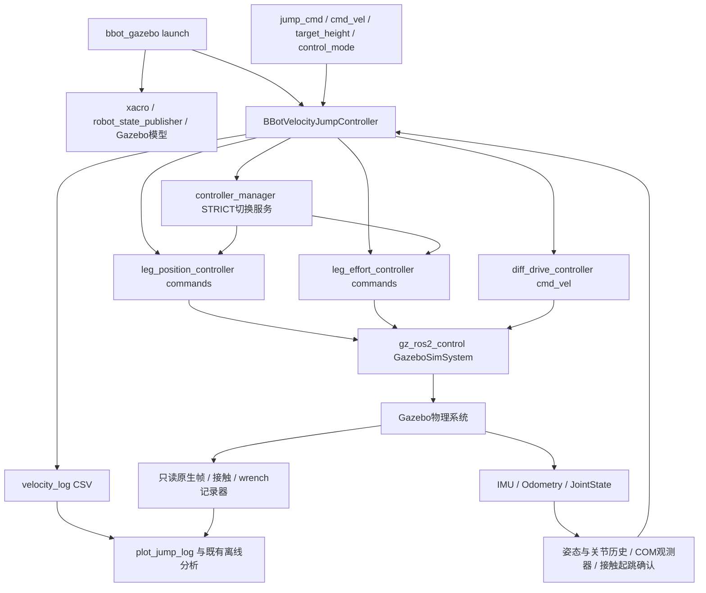
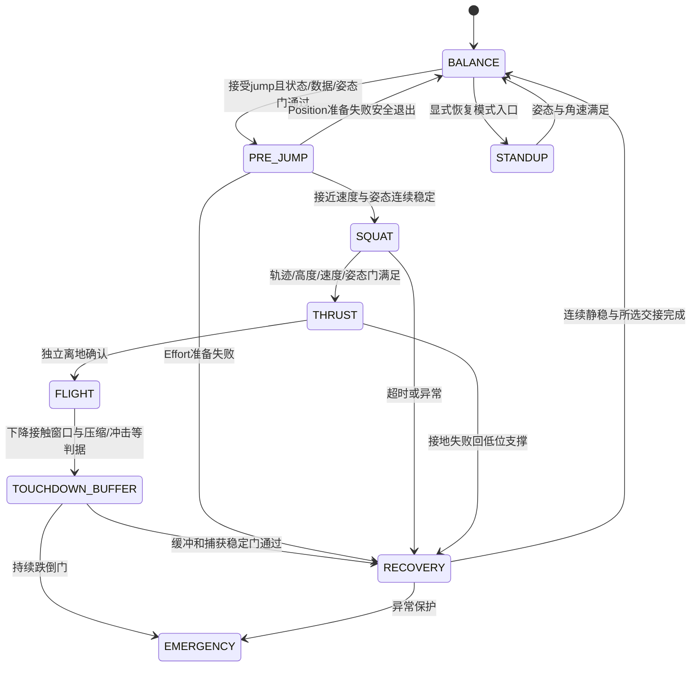
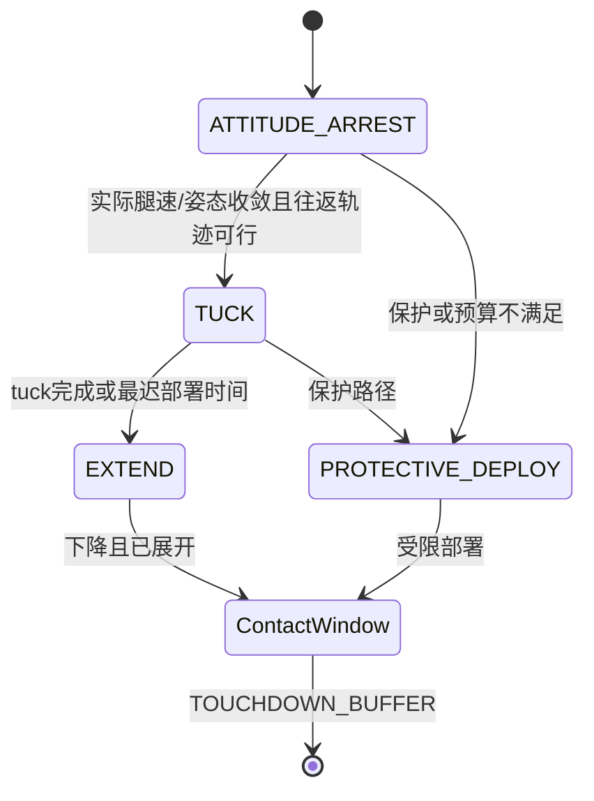
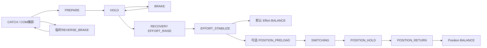

# 第一代 velocity 跳跃控制器技术总结

2026-10-08，基于当前实际工作区源码、已有 Gazebo 记录和验收报告。本文冻结第一代知识，不提出新的控制修改。当前主文件 SHA256：`a17c95bd35eb43b07051ed66777070776bb0d9b4d579ab62fe270e94a7dc09c6`。源码位置与行号对应本轮快照，后续编辑后须重新核对。

第一代已实现完整平地跳跃、空中关节管理、落地缓冲和回到 BALANCE。历史稳定 B1/B2/B3 的双轮同帧最大轮底净空为15.03～16.56 cm，落地最大后退42.76～47.67 cm；尚未达到20 cm及少后退目标。独立 landing-repair/contact-motion 候选仍为 `NO_PHYSICAL_ADMISSION`，不能把它的离线进展写成正式修复验收，也不能据此否认默认 velocity 入口已有完整跳跃。

## 阅读入口与证据层级

- [参数、限制及源码索引](PARAMETERS.md)：76个主文件ROS参数、launch转交及硬编码常量。
- [历史实验与性能总表](EXPERIMENTS.md)：物理运行、离线审查、未实施设计分别标注。
- [实际文件与空间盘点](INVENTORY.md)：全量文件CSV、Git状态、200个campaign索引。
- [目录重组与清理计划](MIGRATION_PLAN.md)：仅方案，未移动或删除。
- 现有入口：[默认完整跳跃说明](../../DEFAULT_FLAT_JUMP.md)、[跳跃导航](../jump/README.md)、[实验导航](../../experiments/jump/README.md)、[独立修复状态](../../LANDING_REPAIR.md)。它们保留各自历史范围，本文不覆盖原报告。

指标引用现有报告及其JSON/CSV；本轮没有新增物理实验、历史动力学计算或测试。报告中的候选建议必须结合后来实验的否决结果阅读。数据与冻结源码是“本地资料”，不假设随Git上传；链接到正式源码和可上传报告，原始资料使用代码路径。

## 1. 系统架构与执行链路

正式入口为 [bbot_gazebo.launch.py](../../src/bbot_bringup/launch/bbot_gazebo.launch.py#L1120) 的 `controller_type=jump_velocity` 分支；默认可执行文件是 `bbot_velocity_jump_controller`。同一节点集成平衡、变高度、跳跃状态机与恢复，并非另一个平衡节点持续与它竞争轮命令。`adaptive_lqr`、经典 `jump`、`jump_reference` 及独立 `jump_landing_repair` 是其他可选实现，不是默认velocity跳跃的串联模块。

[主文件构造与订阅发布](../../src/bbot_balance_controller/src/bbot_velocity_jump_controller.cpp#L587)、[控制配置](../../src/bbot_bringup/config/bbot_controllers.yaml)、[模型接口](../../src/bbot_description/urdf/bbot.urdf.xacro#L2460)：

| 方向 | ROS接口 | 类型 | 实际作用 |
|---|---|---|---|
| 输入 | `/imu` | `sensor_msgs/msg/Imu` | 姿态、角速度、加速度；经控制器/torso观测处理 |
| 输入 | `/model/bbot/odometry` | `nav_msgs/msg/Odometry` | 世界pose及时间戳；速度优先从连续世界位置样本求差分，不能把body twist直接当世界速度 |
| 输入 | `/joint_states` | `sensor_msgs/msg/JointState` | 六关节角度/速度及历史；effort反馈的物理含义须看插件 |
| 输入 | `/cmd_vel`、`/target_height` | `geometry_msgs/msg/Twist`、`std_msgs/msg/Float64` | 用户移动、站高请求 |
| 输入 | `/robot_mode`、`/jump_cmd` | `std_msgs/msg/String` | 模式/跳跃请求；跳跃接受仍需状态和有效性门 |
| 输入 | `/world/flat_jump_world/ground_contact_frames` | `std_msgs/msg/String` | 启用complete-contact路径时使用已有接触帧确认离地；不是原生link真值闭环 |
| 输出 | `/diff_drive_controller/cmd_vel` | `geometry_msgs/msg/TwistStamped` | 轮端线速度/转向参考，不是轮力矩 |
| 输出 | `/leg_position_controller/commands` | `std_msgs/msg/Float64MultiArray` | 四腿关节角参考，顺序左髋、左膝、右髋、右膝 |
| 输出 | `/leg_effort_controller/commands` | `std_msgs/msg/Float64MultiArray` | 同顺序四关节Effort力矩命令 |
| 服务 | `/controller_manager/switch_controller` | `controller_manager_msgs/srv/SwitchController` | STRICT启停腿Position/Effort控制器；异步ACK后更新模式 |

腿的两种控制器都是forward-command接口：Position控制并不在ROS节点输出等效力矩，GazeboSimSystem按位置接口的内部伺服路径驱动。Effort路径由节点计算关节力矩再转交物理接口。模型的`position_proportional_gain=0.3`属于位置执行路径，不是跳跃关节PD刚度。轮子由diff_drive将线速度参考转成两轮角速度接口；wheel radius .07 m、separation .364 m，YAML线速度上限±5 m/s。节点的某些上层限幅更大，不代表实际控制器会执行超过YAML限制的速度。

**必须区分五类量**：节点算法结果→ROS发布值→ros2_control/Gazebo命令组件→物理步消费的执行器输入→引擎关节合力/约束反力。`actual_tau_*`仍是Effort发布前最终命令，不是全程电机实测力矩；`native_wrench`合负载不是电机轴力矩。已有记录器包含命令组件观测，但其源码明确提醒系统执行顺序与Physics消费尚需独立证明，不能把所有命令组件字段升级成真实驱动转矩。相关实现见 [wrench记录器](../../src/bbot_bringup/src/landing_repair_wrench_recorder.cc#L284)。Position期间若只有velocity输入，没有有效force输入，不补算一个“实际力矩”。

## 2. 状态估计、坐标和时间

CAD base坐标：X关节轴，Y前向，Z向上。控制pitch为与模型roll相反的俯仰约定；正轮角速度/正`cmd_x`在这个关节轴约定下对应物理后滚，不能用常见车辆正向直觉判定捕获律符号错误。物理报告pitch通常取原生base四元数负roll，pitch_rate取步后`-world_wx`；IMU滤波曲线有安装参考、过滤和时间延迟，首触冲击时两者不可互换。

[centroidal_state.hpp](../../src/bbot_balance_controller/include/bbot_balance_controller/centroidal_state.hpp#L17) 用body加双腿/轮的七刚体质量几何计算COM：body质量9.5 kg，两侧每侧thigh1.2、shank.8、wheel2.0 kg，总17.5 kg；忽略固定IMU的10 g。`com`和`axle`先在base frame计算，COM不是base原点。

- `centroidal_balance_state`：当前关节几何经IMU pitch的`rotate_about_hip(-pitch,...)`投影，得到轮轴上方高度h、前向偏移r及lean；`atan2(r,h)`不是单纯body pitch。
- `CentroidalLeanRateObserver`：odom世界旋转与插值到同时间戳的四关节几何配对，求lean差分；重复帧不积累新证据，不外推关节，最大年龄80 ms。
- `CentroidalWorldObserver`：世界base位置加旋转后的质量COM偏移，再差分得到COM世界速度，投影至前向轴。
- `CentroidalHeightObserver`：同样基于质量COM求世界高度/竖直速度。`WorldPoseVelocity`有效差分间隔1～80 ms，拒绝reset/teleport等异常。
- `x/x_dot`轮里程计或轮运动估计不能替代真实世界轮轴位移；脚本中首触后的位移必须来自同次原生轮位姿投影。

控制入口 [control_loop](../../src/bbot_balance_controller/src/bbot_velocity_jump_controller.cpp#L1910) 为5 ms wall timer，按仿真时钟推进的有效控制步更新；不能承诺所有运输、ros2_control与物理步严格同步200 Hz。原始物理步为1 ms的试次也不能用控制日志插值冒充每个物理步的独立观测。

当前默认COM捕获几何r/h与世界速度、对齐lean-rate的姿态基准不完全相同。最新坐标一致化实验改善几何误差但没有改善最大后退，仍未采用；不能把那次候选头文件功能写入当前默认实现。

## 3. 顶层状态机和控制模式

枚举见 [JumpState/FlightSubphase/RecoverySubphase](../../src/bbot_balance_controller/src/bbot_velocity_jump_controller.cpp#L84)。顶层编号保持历史CSV兼容：BALANCE0、SQUAT1、THRUST2、FLIGHT3、TOUCHDOWN_BUFFER4、RECOVERY5、STANDUP6、EMERGENCY7、PRE_JUMP8。ARREST/TUCK/EXTEND不是顶层状态；CATCH/REVERSE_BRAKE/PREPARE/BRAKE/HOLD是落地轮控内部阶段。

图仅表达主要转移；各状态分支及公共保护可提前终止或选择保护展腿，不表示每个状态必有相同阈值。STANDUP的BALANCE自动失衡触发代码当前被注释；不能把状态存在写成自动防倒已启用。

| 阶段 / 函数行号 | 进入及退出依据 | 控制目标与算法/输出 | 限制与模式 |
|---|---|---|---|
| BALANCE /2097 | 初始、恢复完成；接受jump转PRE_JUMP，模式命令可进入其他状态 | 平滑站高、IK；按高度插值LQR增益，移动速度外环→pitch内环；启动/未稳时位置参考跟随当前位置 | 首跳通常Position；跳后默认保持Effort支撑和COM捕获。并非永远Position |
| PRE_JUMP /2389 | 触发时锁存高度/前向轴；速度、pitch、rate稳定累计达到门限后下蹲 | 腿保持触发高度；速度参考渐变至.35 m/s，位置只保留诊断；第二跳先等COM连续静稳.50 s才arm | 首跳Position，Effort续跳保持支撑；超时分别安全退出或RECOVERY，不跳过有效性检查 |
| SQUAT /2576 | PRE_JUMP稳定后初始化五次轨迹；轨迹完成+高度速度+运动姿态门，或有条件settling兜底，转THRUST | 从当前高度到.34 m，名义.50 s；末段建立离地姿态/角速参考，轮保持移动准备 | Position首跳；Effort续跳轨迹延长及更严格姿态门。高度已到仍可因rate门超时，不仅按elapsed触发 |
| THRUST /2760 | Position首跳预写支撑后异步切Effort；等待成功和姿态稳定门才推进 | 竖直COM速度反馈+推力shape；IK构型、膝速度反解及PD；髋姿态补偿；轮前速反馈/预测/运动学修正 | 等待ACK时继续Position保持；成功后Effort。推力预算、行程卸载、速度release、超时/塌陷保护；速度达标不等于离地 |
| FLIGHT /4046 | 真实/对齐离地判据确认后；进入ATTITUDE_ARREST或保护路径，下降触地判据转BUFFER | 有界五次关节轨迹+耦合隐式PD，wheel reaction姿态控制；子阶段如下 | 全部Effort；关节位置/速度/加速度、姿态、剩余飞行时间保护 |
| TOUCHDOWN_BUFFER /5150 | 几何下降窗口的压缩/冲击/持续接触，或独立IMU持续支撑判据；不等同真实接触帧 | 锁存实际关节和落地位置；任务空间竖直弹簧阻尼、重力、关节交接与torso分配；轮CATCH到HOLD/BRAKE | Effort。支撑力上限/建力率，COM有效性与阶段门；持续外倒可EMERGENCY |
| RECOVERY /5767 | BUFFER稳定或跳跃失败恢复；连续稳定.50 s后所选交接结束 | EFFORT_RAISE五次站高→EFFORT_STABILIZE；轮复用COM捕获/hold目标、支撑控制 | 默认auto_return_balance=true直接Effort BALANCE；可选Position交接另有预充/切换/保持/回高及失败兜底 |
| STANDUP /6179 | 模式恢复入口；pitch误差<.18且rate<1.5回BALANCE | 低腿IK、按倾向给±2.5 m/s摆起轮参考 | 按实际active模式Position或Effort；不是默认跳跃必经阶段 |
| EMERGENCY /control_loop | 严重异常或相应模式请求；本轮不把退出当成自动复位 | 轮命令置零，腿按实际模式零Effort或保持Position | 属于命令层安全处理，不代表仿真刚体瞬间静止或没有约束反力 |

### FLIGHT子阶段

ARREST以离地实际q/v初始化，减速残余伸腿；其动力学前馈是否启用以试次参数快照为准。TUCK用round-trip预算决定可接受终点和时长，反向运动保护可能把目标退回入口。EXTEND按**新段入口实测q/v**初始化，不是假定静止，也不保证与旧段期望q/v连续。正常默认TUCK完成即可进入EXTEND，没有承诺等COM最高点。PROTECTIVE_DEPLOY是保护展腿，不是正常TUCK已经完成的证明。

### 落地与RECOVERY子阶段

轮阶段是条件式切换，不是固定串行时程。REVERSE_BRAKE有一次性资格及发散释放，默认保留；禁用单次实验已否决。失败推地另走FAIL_CROUCH→FAIL_STABILIZE，后续在安全门满足时重新站高。Position交接失败回Effort支撑，不能将“请求了服务”视为成功切换。模式判断应使用`effort_mode_active`、`leg_mode_switch_pending`与服务结果，而不是旧`controller_mode`字符串或状态名称。

### 阶段门的关键数值与独立证据

这些数值用于维护定位，不改变原门限；完整组合仍以相应函数为准。

- trigger_jump：BALANCE，odom年龄≤.10s，COM/对齐rate有效年龄≤.08s，pitch距平衡点<.25rad、rate<2rad/s、轮估计速度<.30m/s。
- PRE_JUMP：rolling_prepare_ready与COM/对齐rate有效共同成立，稳定累计.08s；默认准备timeout4s。Effort第二跳另先连续静稳.50s。Position准备轮目标裁剪±1.20m/s并按5m/s²平滑。
- SQUAT：正常轨迹结束且`|z_dot|<.25`、`|z−.34|<.060`，还需`|x_dot−jump_forward_speed|≤.12`及姿态/角速门；条件式兜底要求轨迹后.15s、误差<.10且motion_ready，不能绕姿态门。Position首跳pitch误差≤.080；Effort续跳≤.030且rate容差取参数与.10的较小值。轨迹后超时分别.35/1.20s。
- ARREST早期TUCK入口：elapsed≥.015s，髋/膝实际速度≤5.0/6.5rad/s，姿态误差≤.24rad、角速误差≤1.10rad/s，位置安全，剩余时间≥名义TUCK+EXTEND+.025s；仍须完整round-trip轨迹校验，门通过不保证终点有净收腿。
- EXTEND从剩余时间扣除deploy margin，按5ms网格从最长预算向最小.090s搜索可行段，以实测q/v重建。不成功转保护部署，而非放宽限制。
- FLIGHT→BUFFER：几何接触窗口需要对齐几何、最近下降证据和净空≤.035m；压缩需已部署、比目标低.010m且z_dot<−.10。膝力矩spike还需至少2次、下降和净空≤.010；IMU冲击需窗口内filtered acc_z>15。另有persistent_contact和**独立持续支撑通道**：新鲜torso比力fz≥7m/s²且world z_dot<.30，持续50ms即可切入。因此“进入BUFFER”可能早于原生首触，不能拿它对齐物理首触。
- BUFFER→RECOVERY：elapsed≥.40、非CATCH且brake有效并ref<.06、腿速度<.05及高度范围、pitch误差<.060、rate<.20、轮估计速度<.12、capture_settled及命令<.10，共同满足20个连续控制样本。5s软退出仅跳过计数等待，仍保留这些稳定门，不能单凭超时离开。
- RECOVERY→默认Effort BALANCE：有效COM hold条件及pitch误差≤.04、rate≤.15、轮估计速度≤.08、z_dot≤.03持续.50s；不等于与离线“连续1s安静”指标同一个门。

## 4. 实际控制公式

### 4.1 平衡、下蹲与IK

[高度插值](../../src/bbot_balance_controller/src/bbot_velocity_jump_controller.cpp#L6337)为两组LQR增益按腿高混合：`K=(1-a)K_low+a*K_high`，a是低高范围归一化裁剪值。BALANCE并非全程单一`u=-Kx`：有位置参考积分/重锁存、位置软启动、移动速度外环、姿态内环及跳后Effort COM捕获分支。不得用某一组增益概括所有轮控制。

静止端点五次高度：`z=z0+(zf-z0)(10s³−15s⁴+6s⁵)`，`s=clip((t-t0)/T,0,1)`。广义五次关节段`q=a0+a1t+...+a5t⁵`，六个端点约束是起止q/v/a；实际入口速度不必为零。源码：[SQUAT](../../src/bbot_balance_controller/src/bbot_velocity_jump_controller.cpp#L2576)、[flight_trajectory](../../src/bbot_balance_controller/include/bbot_balance_controller/flight_trajectory.hpp)。

[IK](../../src/bbot_kinematics/src/kinematics.cpp#L65)的`target_z`是**机身离地高度**，不是质量COM高度。`dZ=clip(target_z-.07-R,.10,.60)`、`dY=-.01137221`、`d²=dY²+dZ²`；大腿a=.300、小腿b=.34325 m：

`gamma=acos(clip((a²+b²−d²)/(2ab)))`；`psi=acos(clip((a²+d²−b²)/(2ad)))`；`phi1=atan2(dY,dZ)−psi`；`phi2=phi1+pi−gamma`。

`qhip=phi1−phi1_CAD+pitch`，`qknee=(phi2−phi1)−(phi2_CAD−phi1_CAD)`；CAD零位由源码atan2常量定义。落地水平目标另用`inverse_kinematics_with_target_x`（3717行），不是修改该基础IK。名义L_RETRACT=.66、L_TOUCH=.69同样是IK输入，不能当作实际COM目标或保证实际达到的腿长。

### 4.2 THRUST速度反馈、推力和姿态

[目标与反馈](../../src/bbot_balance_controller/src/bbot_velocity_jump_controller.cpp#L471)：若`takeoff_velocity>0`使用显式目标，否则`v*=sqrt(2g*jump_height)`，.25对应约2.215 m/s。这是COM目标，不是净空或实际离地速度。

每腿质量`m_l=M/2`，基本请求形式：`Fz_req=m_l*g + m_l*kv*(v*−vCOM_z) + Fshape`；反馈与shape有启动ramp、接地/姿态门控、行程缩放及release包络，不能把此式未裁剪值当最终施力。shape由early/late形状、peak ratio和运动时钟生成。达release比例触发单调卸力；世界COM速度无效时不宣称达到速度，保留源码已有的受限降级路径。

[力矩预算与分配](../../src/bbot_balance_controller/src/bbot_velocity_jump_controller.cpp#L3210)：实际雅可比计算竖直力到关节的映射；THRUST的髋竖直分担系数为0，主要`tau_knee_ff=Jk_z*Fz`，髋承担构型/机身姿态。膝力矩还包含PD，髋/膝的带符号剩余预算共同限制Fz。建力限制1600 N/s/腿；最终仍受当前关节力矩上限裁剪。不能把THRUST写成无差别完整`JᵀF`双关节分配。

`tau_body/hip=clip(−.5*(70*e_pitch+12*e_rate)+tau_reaction_ff,±20 Nm)`，反作用前馈随期望膝伸展速度有界，之后还有膝刹车反作用和fast-rate修正；最终以源码发布分配为准。低增益髋PD和膝PD与姿态补偿共同作用，不是独立可任意叠加的力矩余量。

[参考膝速](../../src/bbot_balance_controller/src/bbot_velocity_jump_controller.cpp#L3170)用质量COM雅可比和目标COM竖直速度反解，扣除髋/姿态贡献，再经过速度、行程和制动保护；并不是固定高度IK差分速度始终决定推地。轮水平项融合前速误差、姿态项、预测及关节滚动几何补偿，启用情况由profile/真实参数决定；名义stroke结束仍接地可保持当前构型，但不解除超时/力矩/离地门。

### 4.3 空中轨迹与关节控制

[plan_tuck_round_trip](../../src/bbot_balance_controller/src/bbot_velocity_jump_controller.cpp#L3909)根据下降剩余时间、部署保留和关节限制检验整个往返轨迹；[flight_trajectory.hpp](../../src/bbot_balance_controller/include/bbot_balance_controller/flight_trajectory.hpp#L172)按实际起始q/v构造候选、校验位置/速度/加速度，并限制过早反向。B1/B2/B3有效TUCK主要在刹腿，不能因为阶段名写作TUCK就宣称有效屈膝增加净空。

[flight_joint_pd.hpp](../../src/bbot_balance_controller/include/bbot_balance_controller/flight_joint_pd.hpp)的耦合隐式PD以有效质量矩阵M、对角刚度K、阻尼D及预测步h计算：

`A=M+hD+h²K`；`rhs=tau_ff+K(qd−q)+(D+hK)(vd−v)`；`tau=M*A⁻¹*rhs`。

h按采样年龄/周期裁剪，不是随意显式PD相加。可启用的ARREST浮基约化动力学前馈为`Mred*qdd_ref+c_red`，含有效性、幅值及混合保护；不等于已实现全身独立任务逆动力学。轮子空中姿态反作用控制的限幅为线速度等效值，不能由饱和轮速证明电机力矩饱和。

### 4.4 落地布置与COM捕获

[preview/latch](../../src/bbot_balance_controller/src/bbot_velocity_jump_controller.cpp#L3857)由预测前向速度、`omega=sqrt(g/h_capture)`得到原始捕获位移（带deadband），乘`landing_capture_gain`并与wheel back bias组合形成有界landing target_x；再经wheel-first几何限制生成着陆关节目标。这是**空中落地轮轴布置**，不应把gain1.60当作下式`−1.25`的速度反馈系数。触地后重新锁存`touchdown_x_ref/target_x`，恢复回BALANCE再次锁存；无全程追回原起跳点的保证。

[捕获律调用](../../src/bbot_balance_controller/src/bbot_velocity_jump_controller.cpp#L4901)、[实际公式](../../src/bbot_balance_controller/include/bbot_balance_controller/jump_phase_control.hpp#L504)：

`u*=clip(−1.25*vCOM + .25*vref − omega*r − R*shank_rate,±5)`；`omega=sqrt(9.81/clip(h,.15,.55))`。

r是COM相对平均轮轴的前向几何，h是COM高于轮轴的高度；`shank_rate=.5*(vHL+vKL+vHR+vKR)−torso_rate`。轮相对小腿转速与轮轴运动满足相应滚动符号关系`v_axle≈−R*(wheel_rate+hip_rate+knee_rate−pitch_rate)`，冲击/滑动时该关系不能替代世界位置测量。COM有效时这个目标覆盖旧的姿态/位置fallback。

静稳门内积分学习`vref_dot=−vCOM`并裁剪±.60 m/s，用于消除构型偏置导致的creep；门外以1 m/s²回零。它没有把轮速积分成世界位移。普通捕获发布采用`u_k=u_prev+clip(u*−u_prev,±8*dt)`；REVERSE_BRAKE保留自己的目标及12 m/s²分支，不可声称全部落地阶段都只有8。

### 4.5 缓冲、支撑与恢复

[TOUCHDOWN_BUFFER](../../src/bbot_balance_controller/src/bbot_velocity_jump_controller.cpp#L5150)锁存首个控制触地构型，平滑过渡至buffer IK，时长取关节handoff与缓冲行程所需较大值，避免直接跳目标。每腿基本支撑：

`Fz*=clip(Kz*(zref−z)−Dz*zdot+(M/2)*g, .25*(M/2)*g, Fmax)`，Kz450 N/m、Dz75 N·s/m、Fmax240 N；建力率3500 N/s。任务空间支撑与重力、平滑关节PD、torso力矩再经公共发布器的离散反馈及分配处理；日志中的名义PD分量未必等于最终执行的该分量。

[公共Effort发布](../../src/bbot_balance_controller/src/bbot_velocity_jump_controller.cpp#L6614)与支撑函数（6361/6436）包含地面质量/重力、隐式关节反馈、左右髋共同/差动分配、torso与力矩预算。不能依据上层`tau_hip`一行认定没有后级覆盖、限幅或分配。

RECOVERY先以五次轨迹站回.50 m，再检查COM、pitch、rate、轮/高度速度静稳，连续.50 s满足后默认维持Effort进入BALANCE（5940～5977行）。`target_x=x`重锁存避免恢复位置大误差；成功BALANCE不表示轮轴回到首触位置。可选Position交接：.10 s预充→STRICT切换ACK→.25 s保持→.8 s返回；关节/高度/姿态误差或switch失败回Effort，保留失败记录。

## 5. 主要限制与保护

[跳跃请求](../../src/bbot_balance_controller/src/bbot_velocity_jump_controller.cpp#L1371)只在BALANCE且有效world/COM/姿态/速度范围内接受；预备和下蹲有独立timeout与运动门。THRUST等待EffortACK、姿态门连续满足，存在硬阻塞超时、塌陷、行程预卸力、力矩预算和独立接触离地确认；release不是离地证明。空中有whole-trajectory限制、剩余部署预算、保护展腿及轮速上限。落地持续外倒门、支撑和接触有效性、恢复稳定门保留。

限制分层：URDF机械/接口范围、节点当前阶段力矩预算、ros2_control速度界和轨迹参考界不是同一物理量。`sim_relax_thrust_limits`在launch默认true也不意味着任何保护被删除；具体阶段限值由`current_effort_limits`选择。无效日志保持NaN/invalid，物理帧缺失不能以零填充通过验收。安全分支存在或单次正常完成均不证明全部故障条件物理验收通过。

## 6. 已有成果、局限与第二代参考边界

已完成：多控制模式基础平衡与站高，Position→Effort跳跃切换，竖直COM速度闭环推地，空中受保护轨迹/隐式PD，wheel-first部署，落地支撑捕获和Effort恢复，真实接触/世界几何/角动量与命令链的只读诊断，以及不混淆命令和实测量的响应图。

仍存在：净空不足；有效TUCK被残余腿速和反向保护压缩；空中腿运动与浮基姿态、总角动量耦合；高跳负向离地角动量及TUCK/EXTEND阶段放大后倾；落地COM在轮轴后时需要明显轮轴后移捕获；冲击、真实首触与控制阶段进入不同步；几何、姿态、世界速度与运输时延不完全统一；速度接口无法从轮速命令直接获知真实轮执行器转矩；单体大文件、兼容分支和多种参数默认值提高维护成本。

已有否决实验：gain1.00、仅髋动量候选、ARREST早期制动、延后EXTEND、.32高跳、.73提前release、高跳末段前速.43、禁用REVERSE_BRAKE、早期几何一致化；详见[实验结果表](EXPERIMENTS.md)。其中几何一致化证明估计更准确，不代表已证明减少后退；失败高跳23.96 cm不能写成第一代稳定性能。现有证据支持保留这些限制和失败样本作为第二代需求输入，不支持在本轮追加调参或发布新控制器设计。

本轮到此冻结知识；整理实施和任何控制器开发均等待后续单独批准。
