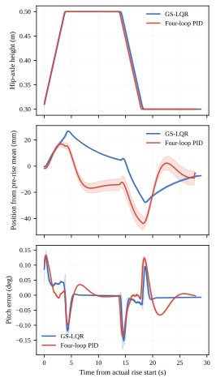
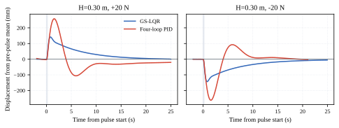

# 第4.2节 四环 PID 与历史五节点 GS-LQR 正式对照

### 4.2 四环位置 PID 与历史五节点 GS-LQR 的正式对照

#### 4.2.1 对照设置与统计口径

本节采用独立的“位置—速度—姿态—角速度”四环串级 PID，位置环只在稳定后的首次 `reset_position` 事件锁定目标，随后高度变化和推扰期间均不重新锁存。位置环参数冻结为 $K_p=0.60$、$K_i=0.005$、$K_d=0.45$，速度指令限幅为 $\pm0.40\ \mathrm{m/s}$；其余三环沿用已验收参数。PID 与 GS-LQR 均采用总力矩 $\pm20\ \mathrm{N\,m}$、单轮 $\pm10\ \mathrm{N\,m}$ 限幅，未启用额外压摆率限制。GS-LQR 使用论文历史五节点增益表（$H=0.30,0.35,0.40,0.45,0.50\ \mathrm{m}$）的独立实验配置，关闭在线自适应；两侧使用相同仿真模型、作用链接、坐标轴、控制周期和启动协议。

定高与推扰采用正式批次的原始日志；升降因 PID 在上升前仍存在明显位置运动，另补跑两侧各3次。旧三环 PID 探索数据和旧 GS-LQR 数据不计入本节。升降补跑中保留了1次 PID 控制器提前保护停机结果，并将1次记录器/spawner协议故障单独留档后重试；控制表现失败不以重试结果替换。

推扰起止时间均取脉冲 sidecar 记录的真实仿真时间。位置峰值 $\Delta p_{\max}$ 相对推扰前 $[t_0-2,t_0]$ 的原始位置均值，在 $[t_0,t_0+1.5\ \mathrm{s}]$ 响应窗内计算；俯仰峰值使用实际俯仰角相对名义平衡角；力矩峰值取脉冲后1.5 s。姿态—速度恢复时间 $T_{\theta v}$ 从脉冲结束 $t_1$ 起算，要求 $|\theta-\theta_{eq}|\le0.5^\circ$、$|v|\le0.02\ \mathrm{m/s}$ 连续保持2 s。另报告返回推扰前位置 $\pm10\ \mathrm{mm}$ 带所需时间和未返回次数。定高与推扰表为 $N=3$ 的均值$\pm$无偏样本标准差；升降表同时标明计划次数与实际完成次数。本节不进行显著性检验。

#### 4.2.2 定高平衡与连续升降

三种定高下，两种控制器的稳态俯仰 RMS 和速度 RMS 均保持在小量级。指标从各次目标锁定后2 s且目标高度连续保持2 s的较晚时刻开始计算；末10 s另计算稳态指标。四环 PID 的位置目标锁定在初始稳定位置，因此其位置误差相对自身固定目标解释，不能与 GS-LQR 的绝对位置状态反馈结果混为同一验收量。正式定高摘要如下。

| 高度 $H$ (m) | 方法 | 稳态俯仰 RMS (°) | 稳态速度 RMS (m/s) | 位置峰值 (mm) | 俯仰峰值 (°) | 力矩峰值 (N·m) | 饱和比例 | 末端位置残差 (mm) |
| :---: | :--- | :---: | :---: | :---: | :---: | :---: | :---: | :---: |
| 0.30 | 四环 PID | 0.0058±0.0000 | 0.0004±0.0001 | 46.440±6.926 | 0.126±0.017 | 0.0346±0.0048 | 0 | 1.654±0.277 |
| 0.30 | GS-LQR | 0.0060±0.0000 | 0.0000±0.0000 | 5.020±1.006 | 0.0063±0.0001 | 0.0037±0.0032 | 0 | 3.039±0.049 |
| 0.40 | 四环 PID | 0.0042±0.0001 | 0.0004±0.0002 | 39.156±17.841 | 0.096±0.041 | 0.0252±0.0104 | 0 | 2.112±0.757 |
| 0.40 | GS-LQR | 0.0044±0.0000 | 0.0000±0.0000 | 2.382±0.022 | 0.0046±0.0000 | 0.0016±0.0006 | 0 | 2.368±0.006 |
| 0.50 | 四环 PID | 0.0029±0.0000 | 0.0002±0.0000 | 20.303±2.159 | 0.044±0.004 | 0.0118±0.0010 | 0 | 1.297±0.135 |
| 0.50 | GS-LQR | 0.0031±0.0000 | 0.0000±0.0000 | 2.975±1.239 | 0.0031±0.0001 | 0.0015±0.0012 | 0 | 1.831±0.092 |

升降补跑使用低位静稳门控：高度误差不超过5 mm、速度不超过0.01 m/s、俯仰偏差不超过0.2°、角速度不超过0.02 rad/s，且前2 s位置跨度不超过5 mm，连续保持5 s后才发送上升指令。上升和下降均由实际高度事件触发，高位保持10 s，返回低位后继续记录10 s。位置曲线以实际上升前2 s原始位置均值为基准，时间轴以实际上升起点为零点。GS-LQR 三次均完成；四环 PID 三次尝试中一次在目标锁定前触发姿态保护停机，另两次完成升降，因此 PID 的升降统计明确标为已完成运行 $N=2/3$，失败尝试保留在协议审计中。

表2 升降补跑结果（完成运行均值±无偏样本标准差）

| 方法 | 计划/完成次数 | 相对位置峰值 (mm) | 俯仰峰值 (°) | 峰值速度 (m/s) | 力矩峰值 (N·m) | 饱和比例 | 终段位置残余 (mm) |
| :--- | :---: | :---: | :---: | :---: | :---: | :---: | :---: |
| 四环 PID | 3/2 | 43.840±4.829 | 0.141±0.0005 | 0.01784±0.00006 | 0.0751±0.0026 | 0 | −11.838±5.142 |
| GS-LQR | 3/3 | 27.815±0.405 | 0.168±0.0008 | 0.01262±0.00007 | 0.0942±0.0054 | 0 | −15.443±0.574 |

两侧在已完成运行中的升降位置和速度峰值仍存在差异：GS-LQR 的相对位置、速度峰值较小，四环 PID 的俯仰和力矩峰值较低；由于四环 PID 有一次控制器保护停机，升降结果不作完整 $N=3$ 的对称重复性结论，也不据此作显著性判断。

图4 四环 PID 与历史五节点 GS-LQR 的往复升降时域响应，依次给出高度、相对位置和俯仰误差。时间轴以实际上升起点为零点，相对位置以该起点前2 s原始均值为零点。

#### 4.2.3 双向推扰响应

图5给出低位 $H=0.30\ \mathrm{m}$ 下的双向推扰响应。每次脉冲仅发布一次 persistent wrench，实际持续时间均在0.19–0.21 s内，随后完成清除；六个高度—方向组合的两侧方向响应均与施力方向一致。表3同时列出位置峰值、实际俯仰峰值、姿态—速度恢复时间、力矩峰值、峰值速度、饱和比例及位置返回时间。

图5 $H=0.30\ \mathrm{m}$ 下 $\pm20\ \mathrm{N}$ 力脉冲的相对位置响应。位置基准为推扰前2 s原始均值，灰色区域为实际施力区间。

表3 多高度双向推扰结果（均值±无偏样本标准差，每组 $N=3$）

| $H$ (m) | 推力 (N) | 方法 | $\Delta p_{\max}$ (mm) | 俯仰峰值 (°) | $T_{\theta v}$ (s) | 峰值力矩 (N·m) | 峰值速度 (m/s) | 饱和比例 | 返回±10 mm (s) |
| :---: | :---: | :--- | :---: | :---: | :---: | :---: | :---: | :---: | :---: |
| 0.30 | +20 | 四环 PID | 257.597±3.588 | 1.934±0.027 | 8.598±0.032 | 1.864±0.021 | 0.298±0.004 | 0 | 未返回 (3/3) |
| 0.30 | +20 | GS-LQR | 142.197±0.814 | 3.356±0.011 | 1.708±0.006 | 2.559±0.306 | 0.308±0.001 | 0 | 16.100±0.579 |
| 0.30 | −20 | 四环 PID | 261.519±1.026 | 1.913±0.006 | 8.689±0.009 | 1.890±0.055 | 0.298±0.001 | 0 | 11.543±2.774 |
| 0.30 | −20 | GS-LQR | 143.330±0.432 | 3.346±0.022 | 1.701±0.002 | 2.530±0.035 | 0.306±0.002 | 0 | 19.060±0.895 |
| 0.40 | +20 | 四环 PID | 243.010±1.247 | 2.123±0.011 | 5.073±0.006 | 2.012±0.021 | 0.315±0.001 | 0 | 未返回 (3/3) |
| 0.40 | +20 | GS-LQR | 154.305±1.936 | 3.183±0.046 | 1.813±0.019 | 2.617±0.073 | 0.326±0.005 | 0 | 17.387±0.742 |
| 0.40 | −20 | 四环 PID | 250.686±1.014 | 2.109±0.013 | 5.019±0.007 | 2.027±0.061 | 0.317±0.001 | 0 | 10.462±1.393 |
| 0.40 | −20 | GS-LQR | 155.477±3.641 | 3.174±0.077 | 1.792±0.021 | 2.692±0.125 | 0.327±0.008 | 0 | 20.981±2.213 |
| 0.50 | +20 | 四环 PID | 230.649±1.079 | 2.328±0.009 | 4.832±0.008 | 2.086±0.054 | 0.334±0.001 | 0 | 未返回 (3/3) |
| 0.50 | +20 | GS-LQR | 163.207±3.445 | 2.997±0.050 | 1.953±0.017 | 2.731±0.126 | 0.340±0.005 | 0 | 17.420±1.199 |
| 0.50 | −20 | 四环 PID | 239.302±2.254 | 2.333±0.025 | 4.777±0.017 | 2.056±0.026 | 0.338±0.003 | 0 | 10.539±0.693 |
| 0.50 | −20 | GS-LQR | 163.072±1.059 | 2.961±0.002 | 1.907±0.004 | 2.834±0.263 | 0.338±0.002 | 0 | 20.575±1.712 |

注：$\Delta p_{\max}$ 相对推扰前 $[t_0-2,t_0]$ 原始位置均值，在 $[t_0,t_0+1.5\ \mathrm{s}]$ 内计算；俯仰为实际角度相对名义平衡角；峰值力矩为脉冲后1.5 s内最大总力矩；$T_{\theta v}$ 从脉冲结束起算并要求阈值连续2 s；“未返回”表示整段记录未进入位置±10 mm带并连续保持2 s。饱和比例为总力矩/单轮力矩限幅的响应窗占比。

#### 4.2.4 结果讨论

六组推扰的重复结果延续了预先规定的性能权衡：GS-LQR 的位置峰值约为四环 PID 的 $0.55\sim0.67$ 倍，姿态—速度恢复约快 $2.5\sim5.1$ 倍；四环 PID 的实际俯仰峰值和峰值力矩在六组工况中均较低。四环 PID 的位置目标被固定在首次稳定位置，因而推扰后的位置返回结果是相对该固定目标的观测量；位置漂移和未返回次数不作为 PID 失效判据。两侧均未出现力矩饱和，方向和清除协议均有效。

以上结果只能说明在本模型、历史 GS-LQR 增益表和冻结四环 PID 参数下观察到稳定的性能权衡。$N=3$ 用于报告运行重复性，不构成统计显著性结论；本节也不加入固定增益 LQR 对照。原探索性日志、旧三环 PID 结果和旧图均保留，不纳入表3或本文正式样本。第4.3节的自适应 GS-LQR 实验和第3章内容保持不变。
