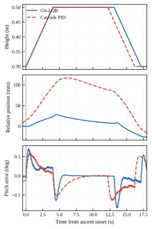
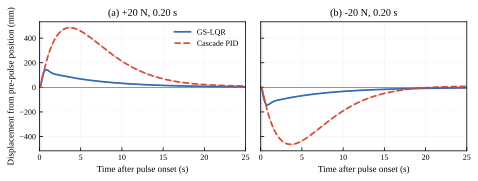
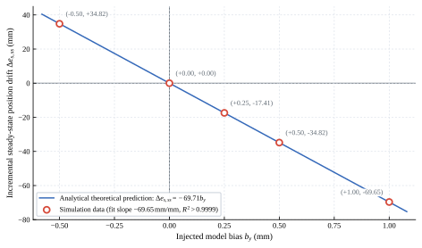
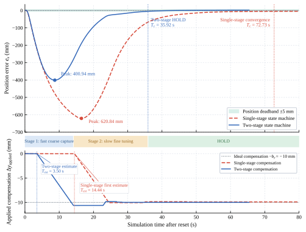
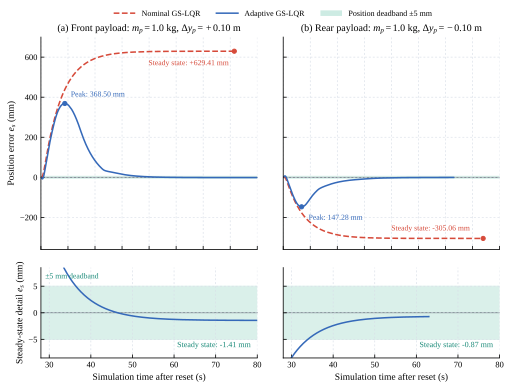

## 4 仿真与实验验证

### 4.1 仿真实验平台设置与评价指标

#### 4.1.1 Gazebo 仿真环境与物理配置

仿真验证基于 ROS 与 Gazebo 物理仿真平台开展，物理引擎采用 ODE，仿真离散积分步长设为 $1\ \mathrm{ms}$（对应 $1000\ \mathrm{Hz}$ 动力学更新频率），控制算法通过 ROS 话题以 $200\ \mathrm{Hz}$ 周期与仿真器闭环交互。

为隔离机械干摩擦效应对准静态平衡点重构与增益调度 LQR 控制机理验证的非线性干扰，机器人的左右两个轮轴驱动关节在 URDF 模型中均显式配置为零库仑摩擦与微小粘性阻尼（`friction="0.0"`, `damping="0.1"`，见 `bbot.urdf.xacro:2433`），地面与驱动轮接触面维持标准接触刚度与防滑摩擦（滑动摩擦系数 $\mu = 1.0$）。该配置保证了系统在理想平衡状态下，执行器无需克服未建模的静摩擦死区即可使车体自然静止，轮端稳态力矩能够严格反映系统姿态偏角与位置静差之间的重力力矩平衡关系（即理论无干摩擦稳态下 $u_{ss} \approx 0\ \mathrm{Nm}$），同时粘性阻尼客观反映了轴承润滑效应。后续开展的所有参数摄动实验、消融对比实验及物理附加载荷实验均在完全相同的环境下运行，以保证控制变量的绝对严密性。

#### 4.1.2 机器人动力学与几何参数

机器人的各连杆质量与惯量参数严格依照 CAD 设计与 URDF 模型建立。悬挂体（Suspended Body）由机身主箱体与双腿连杆机构组成，其名义质量构成为：
- 机箱基座（`base_link`）：名义质量 $m_{\rm base} = 9.5\ \mathrm{kg}$；
- 双腿连杆（左右对称髋、膝杆件）：$2 \times (1.2 + 0.8)\ \mathrm{kg} = 4.0\ \mathrm{kg}$；
- 悬挂体总名义质量：$M_b = m_{\rm base} + m_{\rm legs} = 13.5\ \mathrm{kg}$；
- 左右驱动轮质量各为 $2.00\ \mathrm{kg}$（`bbot.urdf.xacro:2284`），机器人全机名义总质量约为 $M_{\rm all} = 17.5\ \mathrm{kg}$。

在名义工作高度 $H = 0.50\ \mathrm{m}$ 下，机身相关物理与控制参数如下：
- 轮轴参考系下的悬挂体名义质心坐标：纵向偏置 $y_{c,0} = -0.0164269\ \mathrm{m}$，竖直高度 $z_{c,0} = 0.5302655\ \mathrm{m} \approx 0.5303\ \mathrm{m}$；
- 名义重力平衡倾角：$\theta_{\rm eq,0} = -\operatorname{atan2}(y_{c,0}, z_{c,0}) \approx +0.03097\ \mathrm{rad} \approx +1.775^\circ$；
- 实验日志对应版本的增益调度 LQR 状态反馈增益向量（双轮总力矩）：
  $$
  K = [k_s, k_{\dot s}, k_\theta, k_{\dot\theta}] = [-6.382279, -48.847665, -235.922994, -63.359510].
  $$
  控制器输出形式为 $u = -K x = -(k_s s + k_{\dot s} \dot s + k_\theta \theta + k_{\dot\theta} \dot\theta)$。在静态平衡状态下，总力矩归零要求 $k_s e_s + k_\theta e_\theta \approx 0$，由此确立位移与姿态反馈增益比为：
  $$
  -\frac{k_\theta}{k_s} = -\frac{-235.922994}{-6.382279} \approx -36.9653\ \mathrm{m/rad} \approx -36.97\ \mathrm{m/rad}.
  $$

#### 4.1.3 评价指标与统计口径

实验通过以下两类时域指标定量评估控制算法的动态过渡特性与稳态收敛精度。第4.3节与在线自适应事件相关的位置指标基于时间常数 $\tau = 0.50\ \mathrm{s}$（对应截止频率 $f_c = \frac{1}{2\pi\tau} \approx 0.318\ \mathrm{Hz}$）的一阶低通滤波位置信号 $e_s$（`filtered_x_error`，见 `adaptive_equilibrium_estimator.hpp:46`）计算，以与状态机判定信号一致；第4.2节的 PID—GS-LQR 对照指标则从两种控制器共有的原始位姿及速度记录计算，具体定义见4.2.1节：
1. **动态响应指标**：
   - **首次估计/捕获时间 $T_{\rm est}$**：自模型失配或载荷引入起，至状态机首次触发参数估计并施加首步补偿的时间；
   - **最大瞬态漂移 $|e_s|_{\max}$**：闭环调节全过程中机身纵向滤波位置误差的最大峰值；
   - **总收敛时间 $T_c$**：完成 `VERIFY` 状态持续判定并首次进入 `HOLD` 状态的时刻（此后位置持续保持在 $\pm 5\ \mathrm{mm}$ 任务死区内）；
   - **姿态跟踪误差最大值 $\max|e_\theta|$**：实际俯仰角相对于时变平衡角指令的最大动态跟踪偏差 $\max|\theta - \hat{\theta}_{\rm eq}|$；
   - **双轮峰值模型力矩 $\max|u_{\rm model}|$**：双轮总控制力矩指令的最大瞬态幅值（控制器力矩饱和上限设为 $20.0\ \mathrm{Nm}$）。
2. **稳态指标统计口径**：
   - **单次运行稳态指标（运行内时间波动）**：取各实验末尾 15 秒（$[t_{\rm end}-15, t_{\rm end}]$，对应约 3000 个控制周期）的时域均值 $\mu_t$ 及时间标准差 $\sigma_t$，记为 $\mu_t \pm \sigma_t$。该指标反映稳态收敛后系统在静态平衡点附近的微动波动幅度；
   - **重复性实验指标（跨运行样本重复性）**：在相同工况下开展 $N=3$ 次完全独立的闭环运行，各次运行提取末 15 秒稳态时间均值 $\mu_{t,i}$，汇总计算总体均值 $\bar{\mu} = \frac{1}{N}\sum \mu_{t,i}$ 与无偏样本标准差 $s_{N-1} = \sqrt{\frac{1}{N-1}\sum (\mu_{t,i}-\bar{\mu})^2}$，记为 $\bar{\mu} \pm s_{N-1}$（例如 3 次独立运行汇总为 $+1.74 \pm 0.06\ \mathrm{mm}$）。

---

### 4.2 GS-LQR 与串级 PID 的对照验证

#### 4.2.1 对照设置与统计口径

为检验第3章名义 GS-LQR 内环的控制性能，选取传统速度—姿态—角速度三环串级 PID 作为对照。PID 的位置反馈增益设为 $k_x=0$，以 $v_{\rm ref}=0$ 实现零速姿态平衡；GS-LQR 使用轮位移、轮速、俯仰角及俯仰角速度四状态反馈，并关闭在线平衡点自适应。两种控制器均按实时腿高更新控制参数，使用相同的仿真模型、$200\ \mathrm{Hz}$ 控制周期和双轮总力矩限幅 $\pm20\ \mathrm{N\,m}$。因此，本节比较的是两种闭环控制结构在同一任务下的响应，而非增益调度与固定增益的消融效果。

实验包括 $H=0.30$、$0.40$、$0.50\ \mathrm{m}$ 定高平衡、$0.30\to0.50\to0.30\ \mathrm{m}$ 往复升降（$0.05\ \mathrm{m/s}$），以及各高度下施加在机身上的 $\pm20\ \mathrm{N}$、$0.20\ \mathrm{s}$ 纵向力脉冲。定高与升降每条件取3次独立有效运行；推扰每控制器—高度—方向组合取3次。脉冲起点以力作用记录的仿真时间为准，并核验单次施力、实际持续时间及清除状态。为避免把 PID 推扰前已有的原点偏移误记为冲击位移，脉冲最大相对位移 $\Delta p_{\max}$ 以推扰前2 s位置均值为基准，在起点后25 s内取最大绝对偏差。姿态—速度恢复时间 $T_{\theta v}$ 从脉冲结束时刻起算，定义为俯仰误差不超过 $0.5^\circ$ 且轮速不超过 $0.02\ \mathrm{m/s}$，并连续保持2 s的首次进入时间。比较指标由两种控制器共有的原始位姿、速度及俯仰记录计算；PID 的位置不参与反馈，也不以返回原点作为稳定性验收条件。

#### 4.2.2 定高平衡与连续升降

基于第2章线性化模型，对实验所用的五节点 GS-LQR 增益表在 $H=0.30\sim0.50\ \mathrm{m}$ 上以 $1\ \mathrm{mm}$ 间隔作冻结高度扫描；考虑200 Hz控制周期与100 Hz IMU采样保持及速度、俯仰角速度低通滤波后，201个高度点的最大闭环谱半径为 $0.999304<1$。该结果支持各冻结构型下的局部线性稳定性，不等同于任意快速升降轨迹的稳定性证明。在三个代表高度，PID 的3次有效定高运行均满足末8 s俯仰误差 RMS 不超过 $0.05^\circ$ 的验收条件，说明其具备基本姿态平衡能力。然而，其终段相对固定原点的位移为 $0.20\sim0.85\ \mathrm{m}$，且重复运行之间离散程度较大。名义 GS-LQR 在相同高度的末15 s平均位置误差为 $1.82\sim2.94\ \mathrm{mm}$，均进入 $\pm5\ \mathrm{mm}$ 定点任务带。上述位置差异与两者是否引入位置反馈有关，并不意味着 PID 姿态失稳。

图4给出一次往复升降的代表性响应。各曲线以实际开始上升的时刻对齐，位置以其前2 s均值归零；控制器高位停留时长略有差异，因此只比较各自升降全过程的幅值，不逐点比较下降时刻。3次运行中，PID 与 GS-LQR 的最大俯仰误差分别为 $0.128\pm0.001^\circ$ 和 $0.166\pm0.001^\circ$；最大相对位移分别为 $138.39\pm42.54\ \mathrm{mm}$ 和 $27.53\pm0.24\ \mathrm{mm}$。PID 的姿态峰值较低，GS-LQR 的位置偏移较小，两者均未出现姿态发散。由于 PID 在升降前已有缓慢位置漂移，此处的相对位移是整个轨迹的观测量，不能单独归因于构型变化。

图4 GS-LQR 与三环串级 PID 在往复升降工况下的代表性时域响应。位置以各自上升前2 s均值为基准。

#### 4.2.3 双向推扰响应

图5给出 $H=0.30\ \mathrm{m}$ 下双向力脉冲的代表性位置响应。PID 的位移峰值较大，但在观察窗口末端可接近其*推扰前位置*；该图采用相对基准，不能据此判断 PID 已返回固定原点。六组高度—方向工况的统计结果列于表3。GS-LQR 的最大相对位移较 PID 降低 $57.0\%\sim70.4\%$，$T_{\theta v}$ 为 PID 的约 $12\%\sim16\%$。相反，PID 的瞬态俯仰峰值较低：三个高度的范围为 $0.92^\circ\sim1.20^\circ$，GS-LQR 为 $2.96^\circ\sim3.35^\circ$；GS-LQR 的双轮峰值力矩约为 $2.41\sim2.79\ \mathrm{N\,m}$，PID 约为 $1.81\sim1.99\ \mathrm{N\,m}$，均低于限幅。该结果体现了更快的位移及速度调节与较大短时姿态、力矩动作之间的权衡。

图5 $H=0.30\ \mathrm{m}$ 下 $\pm20\ \mathrm{N}$ 力脉冲的相对位移时程。粗线为代表性运行，浅线为其余重复；灰色区域表示施力持续时间。

表3 多高度双向推扰结果（均值±样本标准差，每组 $N=3$）

| $H$ (m) | 推力 (N) | 方法 | $\Delta p_{\max}$ (mm) | 俯仰峰值 (°) | $T_{\theta v}$ (s) |
| :---: | :---: | :--- | :---: | :---: | :---: |
| 0.30 | +20 | GS-LQR | 143.1±0.4 | 3.35±0.004 | 1.71±0.01 |
| 0.30 | +20 | 三环 PID | 484.2±1.3 | 0.94±0.004 | 14.05±0.01 |
| 0.30 | −20 | GS-LQR | 143.1±0.6 | 3.33±0.012 | 1.70±0.00 |
| 0.30 | −20 | 三环 PID | 466.2±2.5 | 0.92±0.004 | 14.01±0.03 |
| 0.40 | +20 | GS-LQR | 152.7±0.1 | 3.14±0.005 | 1.80±0.01 |
| 0.40 | +20 | 三环 PID | 454.6±5.0 | 1.08±0.011 | 13.09±0.05 |
| 0.40 | −20 | GS-LQR | 152.9±0.6 | 3.13±0.016 | 1.80±0.00 |
| 0.40 | −20 | 三环 PID | 425.8±3.9 | 1.06±0.010 | 13.22±0.06 |
| 0.50 | +20 | GS-LQR | 161.8±0.6 | 2.96±0.010 | 1.93±0.00 |
| 0.50 | +20 | 三环 PID | 419.6±7.5 | 1.20±0.022 | 11.89±0.14 |
| 0.50 | −20 | GS-LQR | 165.2±3.9 | 3.01±0.070 | 1.94±0.04 |
| 0.50 | −20 | 三环 PID | 384.6±2.2 | 1.18±0.006 | 12.30±0.05 |

注：位置峰值相对推扰前2 s均值计算；$T_{\theta v}$ 从脉冲结束起算。俯仰误差相对各控制器的实时名义平衡角计算，表中标准差按未四舍五入的数据求得。

#### 4.2.4 结果讨论

GS-LQR 在上述名义工况下同时实现姿态稳定与定点保持，三环 PID 则更偏向抑制俯仰峰值。以 $H=0.30\ \mathrm{m}$ 为例，PID 推扰前相对固定原点已有约 $0.28\sim0.32\ \mathrm{m}$ 偏移；故其末端绝对偏移主要包含先前累积量，不能归因于力脉冲本身。在本基线 $k_x=0$ 的条件下，PID 无法主动消除固定原点偏差，而 GS-LQR 的位置状态反馈提供了该调节通道。第4.3节进一步考察名义平衡角失配时这一通道的局限及在线补偿效果。本节未设置固定增益 LQR 对照，因此结论仅涉及 GS-LQR 与所选 PID 结构的任务性能差异，不用于证明增益调度相对固定增益 LQR 的独立收益。

---

## 4.3 在线平衡点自适应与载荷鲁棒性验证

### 4.3.1 模型失配下的自适应补偿效果

在平整地面定点平衡控制中，控制器内部采用的名义质心参数与实际系统存在偏差时，系统的稳态平衡特性与位置保持能力将受到显著影响。为探究平衡点模型失配对增益调度 LQR 的影响机理，首先在名义工作高度 $H=0.50\ \mathrm{m}$ 下，对比零偏置基准（$b_y=0$）与人为注入对称模型偏置（$b_y=\pm0.50\ \mathrm{mm}$）的名义闭环响应。仿真实验表明，在标准仿真环境下，零偏置基准下的稳态位置误差为 $e_{s,ss}\approx+1.98\ \mathrm{mm}$，轮端稳态控制力矩趋近于零。当向控制器模型注入 $b_y=+0.50\ \mathrm{mm}$ 与 $-0.50\ \mathrm{mm}$ 偏差时，未补偿的名义 GS-LQR 闭环系统分别产生 $-32.85\ \mathrm{mm}$ 与 $+36.80\ \mathrm{mm}$ 的稳态位置偏移。扣除零偏置基准后，附加名义位置漂移分别为 $-34.83\ \mathrm{mm}$ 和 $+34.82\ \mathrm{mm}$，两者幅值几乎相等而符号相反，表明该亚毫米级偏置引起的稳态偏移近似关于原点对称。这一结果证实，在无积分环节的状态反馈平衡控制器中，亚毫米级的平衡点模型失配即可引发数十毫米级的显著位置漂移。

为检验在线自适应能否有效消除上述稳态漂移，控制器设置名义控制（Nominal GS-LQR）、已知偏置补偿（Known-Bias GS-LQR）与在线自适应控制（Adaptive GS-LQR）三种模式进行闭环性能对比。Known-Bias 模式直接在控制器中补偿已知的注入偏差量（$\Delta y_{\rm applied} = -b_y$），用于验证平衡角映射关系的物理正确性；Adaptive 模式则仅依赖准静态几何观测与两级状态机在线估计等效偏置并施加补偿。对比实验结果如表4所示。

表4 模型失配下三种控制模式稳态性能对比（$H=0.50\ \mathrm{m}, b_y=\pm0.50\ \mathrm{mm}$）

| 控制模式 | 注入偏差 $b_y$ | 实际施加补偿 $\Delta y_{\rm applied}$ | 首次估计时间 $T_{\rm est}$ | 总收敛时间 $T_c$ | 稳态位置误差 $e_{s,ss}$ | 相对名义绝对误差降低 | 附加漂移消除率 | 轮端稳态力矩 $u_{ss}$ |
| :--- | :---: | :---: | :---: | :---: | :---: | :---: | :---: | :---: |
| **Nominal** | $+0.50\ \mathrm{mm}$ | $0.000\ \mathrm{mm}$ | — | — | $-32.85\ \mathrm{mm}$ | — | — | $\approx 0.00\ \mathrm{Nm}$ |
| **Known-Bias** | $+0.50\ \mathrm{mm}$ | $-0.500\ \mathrm{mm}$ | — | — | $+1.98\ \mathrm{mm}$ | $94.0\%$ | $100.0\%$ (恢复基准) | $\approx 0.00\ \mathrm{Nm}$ |
| **Adaptive** | $+0.50\ \mathrm{mm}$ | $-0.502\ \mathrm{mm}$ | **$3.59\ \mathrm{s}$** | **$9.83\ \mathrm{s}$** | **$+1.56 \pm 0.36\ \mathrm{mm}$** | **$95.3\%$** | **$98.8\%$** | $\approx 0.00\ \mathrm{Nm}$ |
| **Nominal** | $-0.50\ \mathrm{mm}$ | $0.000\ \mathrm{mm}$ | — | — | $+36.80\ \mathrm{mm}$ | — | — | $\approx 0.00\ \mathrm{Nm}$ |
| **Known-Bias** | $-0.50\ \mathrm{mm}$ | $+0.500\ \mathrm{mm}$ | — | — | $+1.98\ \mathrm{mm}$ | $94.6\%$ | $100.0\%$ (恢复基准) | $\approx 0.00\ \mathrm{Nm}$ |
| **Adaptive** | $-0.50\ \mathrm{mm}$ | $+0.513\ \mathrm{mm}$ | **$2.69\ \mathrm{s}$** | **$10.09\ \mathrm{s}$** | **$+1.33 \pm 0.15\ \mathrm{mm}$** | **$96.4\%$** | **$98.1\%$** | $\approx 0.00\ \mathrm{Nm}$ |

> 注：
> 1. “相对名义绝对误差降低”定义为 $\eta_{\rm abs} = (|e_{s,ss}^{\rm nominal}| - |e_{s,ss}|)/|e_{s,ss}^{\rm nominal}|$；
> 2. “附加漂移消除率”以扣除零偏置系统固有基准误差（$e_{s,0} = +1.98\ \mathrm{mm}$）后的附加位移量计算，即 $\eta_{\rm add} = (|\Delta e_{s,ss}^{\rm nominal}| - |\Delta e_{s,ss}|)/|\Delta e_{s,ss}^{\rm nominal}|$，Known-Bias 模式精确恢复基准，附加消除率为 $100.0\%$；
> 3. Adaptive 模式稳态误差给出末尾 15 秒（$[t_{\rm end}-15, t_{\rm end}]$）的时域均值与时间波动标准差。

由表4可见，Known-Bias 模式在施加理论补偿量后，稳态位置误差完全恢复至 $0\ \mathrm{mm}$ 偏置时的基准值 $+1.98\ \mathrm{mm}$，验证了第 3 章中平衡角与水平偏置映射关系式(16)的准确性。在 Adaptive 自适应模式下，两级状态机在未获知任何先验偏置信息的条件下，仅耗时 $T_{\rm est}=2.69\sim3.59\ \mathrm{s}$ 即可迅速捕获主要偏差，并在约 $10\ \mathrm{s}$ 内（分别为 $9.83\ \mathrm{s}$ 与 $10.09\ \mathrm{s}$）进入 `HOLD` 状态实现全局收敛，施加的最终修正量为 $-0.502\ \mathrm{mm}$ 与 $+0.513\ \mathrm{mm}$（与理论需求偏差仅 $2\sim13\ \mu\mathrm{m}$），将车体稳态位置误差分别收敛至 $+1.56 \pm 0.36\ \mathrm{mm}$ 与 $+1.33 \pm 0.15\ \mathrm{mm}$。相对名义绝对漂移分别降低 $95.3\%$ 与 $96.4\%$，由模型偏置引起的附加漂移消除率高达 $98.8\%$ 与 $98.1\%$，均稳定进入预设的 $\pm 5\ \mathrm{mm}$ 任务死区内。同时，稳态轮端力矩保持在零附近，表明自适应过程通过重构几何平衡点实现静止，而非依赖持续的执行器力矩对抗漂移。

为进一步探究失配幅值与闭环稳态漂移的定量关系，在 $H=0.50\ \mathrm{m}$ 下系统评估了 $b_y \in \{-0.50, 0.00, +0.25, +0.50, +1.00\}\ \mathrm{mm}$ 跨度内的名义稳态位置偏移量。理论上，由无积分状态反馈的静力矩平衡条件 $k_s \Delta e_{s,ss} + k_\theta \Delta \theta_{\rm eq} \approx 0$ 以及微偏倾角近似 $\Delta \theta_{\rm eq} \approx b_y / z_{c,0}$，可得名义附加位置漂移与水平模型偏差的解析映射关系：
$$
\Delta e_{s,ss}^{\rm theory} = -\frac{k_\theta}{k_s z_{c,0}} b_y = -\frac{36.9653}{0.5302655} b_y \approx -69.711\, b_y \approx -69.71\, b_y \quad [\mathrm{mm/mm}].
\tag{17}
$$
模型偏置幅值与名义稳态位置漂移的关系如图6所示。

图6 模型偏置幅值与名义稳态位置漂移的关系（$H=0.50\ \mathrm{m}$）

由图6可见，仿真测得的 5 组附加位置漂移数据点严格分布于解析理论预测线之上。过原点线性回归拟合得到的经验斜率为 $k_{\rm sim} = -69.65\ \mathrm{mm/mm}$（拟合优度 $R^2 > 0.9999$），与理论预测斜率 $-69.71\ \mathrm{mm/mm}$ 之间的相对偏差小于 $0.1\%$。这不仅严格定量证实了亚毫米级几何偏差放大为数十毫米级空间漂移的内在重力平衡机理，也充分验证了仿真平台与多刚体动力学模型的高精度一致性。

---

### 4.3.2 两级自适应方法的动态性能

为克服传统单级自适应方法在面对较大模型偏差时观测窗口长、粗捕响应滞后及过渡过程漂移过大的缺陷，第 3 章设计了两级自适应状态机（Stage 1 快速粗捕 + Stage 2 慢速精修）。为全面评估两级架构的动态性能优势，在名义工作高度 $H=0.50\ \mathrm{m}$ 下开展消融对比、多扰动幅值响应、重复性及正负对称性验证实验。

为显式验证两级解耦架构中快速粗捕级的核心作用，首先设计单级状态机作为**消融对照基准（Ablation Baseline）**：关闭两级架构中的宽松门控粗捕支路，仅保留严格准静态门控与固定速率精修调节（状态流转为 `WAIT_CAPTURE` $\to$ `APPLY_TARGET` $\to$ `VERIFY` $\to$ `HOLD`），施加速率与两级状态机统一设为 $v_y^{\max} = 1.0\ \mathrm{mm/s}$ 以确保对比严谨公允。

针对典型大幅值模型失配工况 $b_y=+10.0\ \mathrm{mm}$ 开展消融对比实验，实测动态响应对比如表5前两行所示。在单级消融基准机制下，由于必须等待较长的严格准静态滤波窗口，算法直至 $t=14.44\ \mathrm{s}$ 方触发首次补偿，导致机身最大位置漂移达到 $|e_s|_{\max}=620.84\ \mathrm{mm}$，整体稳定时间长达 $T_c=72.73\ \mathrm{s}$。相比之下，两级自适应状态机在启动后仅 $T_{\rm est}=3.50\ \mathrm{s}$ 即由 Stage 1 迅速识别主要偏差并实施大步长预补偿（捕获触发提前了 $75.8\%$），在机器人发生深度漂移前施加有效制动，将最大瞬态位移截断至 $400.94\ \mathrm{mm}$（相对单级降低 **$35.4\%$**）；随后 Stage 2 自动无缝介入平滑精修，在 $T_c=35.92\ \mathrm{s}$ 经 `VERIFY` 判定后首次进入 `HOLD` 完成全局收敛（较单级加速 **$50.6\%$**），稳态残余误差控制在 $+1.69\ \mathrm{mm}$（末 15 秒波动 $\pm 0.20\ \mathrm{mm}$）。单级与两级架构在该工况下的位置误差时域对比如图7所示。

图7 $b_y=+10\ \mathrm{mm}$ 下单级消融基准与两级自适应位置误差时域对比（$H=0.50\ \mathrm{m}$）

表5 两级自适应状态机动态性能与鲁棒性实验汇总（$H=0.50\ \mathrm{m}$）

| 算法架构 | 注入偏差 $b_y$ | 首次估计/捕获时间 $T_{\rm est}$ | 最大位置漂移 $|e_s|_{\max}$ | 相对单级漂移降低 | 总收敛时间 $T_c$ | 相对单级加速 | 稳态位置误差 $e_{s,ss}$ |
| :--- | :---: | :---: | :---: | :---: | :---: | :---: | :---: |
| **单级状态机 (消融基准)** | $+10.0\ \mathrm{mm}$ | $14.44\ \mathrm{s}$ | $620.84\ \mathrm{mm}$ | — | $72.73\ \mathrm{s}$ | — | $-4.27\ \mathrm{mm}$ |
| **两级状态机** | $+10.0\ \mathrm{mm}$ | **$3.50\ \mathrm{s}$** | **$400.94\ \mathrm{mm}$** | **$35.4\%$** | **$35.92\ \mathrm{s}$** | **$50.6\%$** | **$+1.69\ \mathrm{mm}$** |
| **两级状态机** | $+1.0\ \mathrm{mm}$ | $3.30\ \mathrm{s}$ | $24.33\ \mathrm{mm}$ | — | $16.65\ \mathrm{s}$ | — | $-1.07\ \mathrm{mm}$ |
| **两级状态机** | $+5.0\ \mathrm{mm}$ | $3.84\ \mathrm{s}$ | $175.90\ \mathrm{mm}$ | — | $32.68\ \mathrm{s}$ | — | $-0.45\ \mathrm{mm}$ |
| **两级状态机** | $-5.0\ \mathrm{mm}$ | $3.79\ \mathrm{s}$ | $182.89\ \mathrm{mm}$ | — | $32.89\ \mathrm{s}$ | — | $+0.32\ \mathrm{mm}$ |
| **两级重复性** | $+10.0\ \mathrm{mm}$ (3次独立运行) | $3.60 \pm 0.08\ \mathrm{s}$ | $401.65 \pm 3.64\ \mathrm{mm}$ | — | $36.19 \pm 0.23\ \mathrm{s}$ | — | $+1.74 \pm 0.06\ \mathrm{mm}$ |

> 注：重复性行各指标给出 3 次完全独立仿真的样本均值与无偏样本标准差（$s_{N-1}$）。单次实验稳态误差取末 15 秒（$[t_{\rm end}-15, t_{\rm end}]$）均值。

进一步拓展多工况验证，实验呈现出以下关键特性：
1. **多幅值自适应调节规律**：在 $b_y=1.0\ \mathrm{mm}$、$5.0\ \mathrm{mm}$ 与 $10.0\ \mathrm{mm}$ 多组不同失配幅值下，两级状态机的首次触发时间高度稳定在 $T_{\rm est}=3.30\sim3.84\ \mathrm{s}$ 区间内，总收敛时间依次为 $16.65\ \mathrm{s}$、$32.68\ \mathrm{s}$ 与 $35.92\ \mathrm{s}$。小扰动下系统在单次粗捕后即可快速进入 $\pm 5\ \mathrm{mm}$ 任务死区收敛，大扰动下则通过多步精修稳步消除残差，表现出与扰动强度高度匹配的自适应阶梯式收敛特征。
2. **独立重复性**：在 $b_y=+10.0\ \mathrm{mm}$ 条件下开展 3 次完全独立的重复实验，总收敛时间为 $T_c=36.19 \pm 0.23\ \mathrm{s}$（相对标准差 RSD 仅 $0.63\%$），最大位置漂移为 $401.65 \pm 3.64\ \mathrm{mm}$（RSD 仅 $0.91\%$），稳态位置误差为 $+1.74 \pm 0.06\ \mathrm{mm}$，验证了两级状态机时序流转具有极高的确定性与复现性。
3. **正负方向一致性**：在 $\pm 5.0\ \mathrm{mm}$ 对称工况下，正、负偏置的总收敛时间分别为 $32.68\ \mathrm{s}$ 与 $32.89\ \mathrm{s}$（吻合度达 $99.4\%$），瞬态漂移峰值分别为 $175.90\ \mathrm{mm}$ 与 $182.89\ \mathrm{mm}$（吻合度达 $96.1\%$），排除了算法在正负坐标方向上的不对称性失真。
4. **施加速率参数整定**：在补偿施加支路中，参数扫描实验表明过快提高补偿斜率（如提高至 $1.5\sim2.0\ \mathrm{mm/s}$）无法进一步显著缩短整体恢复时间，反而会导致瞬态俯仰偏角与峰值力矩激增超过 $50\%$，并引发准静态门控频繁重置与力矩饱和风险；因此后续实验统一固定采用兼顾平稳过渡与快速响应的最优斜率 $v_y^{\max}=1.0\ \mathrm{mm/s}$。

---

### 4.3.3 真实附加载荷鲁棒性验证

前两节的模型偏置注入实验（$b_y$）基于控制器内部参数人为扰动，验证了准静态平衡角映射与几何观测算法的闭环机理。然而在实际应用中，未建模负载通常以实体形式附着在机器人车体上，这将同时导致机器人总质量 $M$、纵向质心 $y_c$、竖直质心 $z_c$ 以及悬挂体绕转轴转动惯量 $I_b$ 发生综合多维失配，真正对应于论文核心研究的“物理质量分布不确定性”。

为严谨检验所提算法在面对真实多物理参数摄动时的自适应鲁棒性，本节在 Gazebo 仿真环境中的机器人机箱顶部物理安装规则长方体配重（尺寸 $0.12\times0.08\times0.02\ \mathrm{m}$，质量 $m_p=1.0\ \mathrm{kg}$，占机器人悬挂体名义质量 $M_b=13.5\ \mathrm{kg}$ 的 $7.41\%$）。在 `base_link` 坐标系中，配重质心的完整三维安装坐标为 $[x_p, y_p, z_p] = [0.200, 0.125 + \Delta y_p, 0.170]\ \mathrm{m}$（见 `bbot.urdf.xacro:2701-2748`），相对于轮轴的等效垂直安装高度约为 $z_{p,\rm axle} \approx 0.700\ \mathrm{m}$。控制器底层保持原有名义参数完全冻结不变，即继续使用未加配重时的名义增益调度表 $K(H)$ 以及名义质心坐标 $y_{c,0}(H), z_{c,0}(H)$。

在机械几何关系上，以机身髋关节垂面在 `base_link` 坐标系中的位置 $y_{\rm hip}=0.125\ \mathrm{m}$ 为安装基准，分别设置前置（$\Delta y_p=+0.10\ \mathrm{m}$，即 $y_p = 0.225\ \mathrm{m}$）与后置（$\Delta y_p=-0.10\ \mathrm{m}$，即 $y_p = 0.025\ \mathrm{m}$）两组典型偏心配重工况。根据机构运动学关系，双轮足机器人的轮轴相对髋关节存在恒定的纵向几何偏置 $\Delta Y = -0.01137221\ \mathrm{m}$，因此轮轴中心在 `base_link` 中的坐标为 $y_{\rm axle} = 0.11362779\ \mathrm{m}$；换算至轮轴平衡参考系后，悬挂体名义质心的纵向坐标为 $y_{c,0} = -0.0164269\ \mathrm{m}$。前置与后置配重在该参考系下的纵向坐标及其相对名义质心的有效力臂为
$$
\begin{aligned}
y_{p,f}&=0.225-0.11362779=+0.11137221\ \mathrm{m}, & d_f&=y_{p,f}-y_{c,0}=+0.127799\ \mathrm{m}\approx+0.1278\ \mathrm{m},\\
y_{p,r}&=0.025-0.11362779=-0.08862779\ \mathrm{m}, & d_r&=y_{p,r}-y_{c,0}=-0.072201\ \mathrm{m}\approx-0.0722\ \mathrm{m}.
\end{aligned}
\tag{20}
$$
两者的力臂绝对值之比为 $|d_f / d_r| \approx 1.77 : 1$。按刚体质心公式计算，在悬挂体总质量变为 $M_{\rm tot}=14.5\ \mathrm{kg}$ 后，理论等效水平质心改变量为
$$
\begin{aligned}
\Delta y_{c,f}^{\rm theory}&=\frac{m_p d_f}{M_{\rm tot}}=\frac{1.0 \times (+0.1278)}{14.5}=+8.814\ \mathrm{mm},\\
\Delta y_{c,r}^{\rm theory}&=\frac{m_p d_r}{M_{\rm tot}}=\frac{1.0 \times (-0.0722)}{14.5}=-4.979\ \mathrm{mm}.
\end{aligned}
\tag{21}
$$

实验共设置 5 组对照工况：无附加载荷基准（P0）、前置 1.0 kg 名义控制与自适应控制（P1/P2）、后置 1.0 kg 名义控制与自适应控制（P3/P4）。各工况稳态指标取末尾 15 秒（$[t_{\rm end}-15, t_{\rm end}]$）均值与时间波动标准差。统计结果汇总于表6。

表6 真实 $1.0\ \mathrm{kg}$ 附加载荷闭环实验结果对比（$H=0.50\ \mathrm{m}$）

| 编号 | 附加载荷工况 | 控制方法 | 首次估计时间 $T_{\rm est}$ | 最大位置漂移 $|e_s|_{\max}$ | 总收敛时间 $T_c$ | 稳态位置误差 $e_{s,ss}$ (末15s) | 最大姿态偏差 $\max|e_\theta|$ | 峰值总力矩 $\max|u_{\rm model}|$ | 最终等效补偿 $\hat{\Delta y}_c$ |
| :---: | :--- | :--- | :---: | :---: | :---: | :---: | :---: | :---: | :---: |
| **P0** | $0\ \mathrm{kg}$ 基准 | Nominal GS-LQR | — | $1.98\ \mathrm{mm}$ | — (未补偿) | $+1.98 \pm 0.00\ \mathrm{mm}$ | $0.03^\circ$ | $0.10\ \mathrm{Nm}$ | $+0.000\ \mathrm{mm}$ |
| **P1** | $1\ \mathrm{kg}$ 前置 | Nominal GS-LQR | — | $629.45\ \mathrm{mm}$ | — (未补偿) | $+629.41 \pm 0.04\ \mathrm{mm}$ | $1.07^\circ$ | $2.83\ \mathrm{Nm}$ | $+0.000\ \mathrm{mm}$ |
| **P2** | $1\ \mathrm{kg}$ 前置 | **Adaptive GS-LQR** | **$4.09\ \mathrm{s}$** | **$368.50\ \mathrm{mm}$** | **$36.53\ \mathrm{s}$** | **$-1.41 \pm 0.02\ \mathrm{mm}$** | **$1.09^\circ$** | **$5.40\ \mathrm{Nm}$** | $+9.055\ \mathrm{mm}$ |
| **P3** | $1\ \mathrm{kg}$ 后置 | Nominal GS-LQR | — | $305.07\ \mathrm{mm}$ | — (未补偿) | $-305.06 \pm 0.01\ \mathrm{mm}$ | $0.53^\circ$ | $1.76\ \mathrm{Nm}$ | $+0.000\ \mathrm{mm}$ |
| **P4** | $1\ \mathrm{kg}$ 后置 | **Adaptive GS-LQR** | **$3.54\ \mathrm{s}$** | **$147.28\ \mathrm{mm}$** | **$34.19\ \mathrm{s}$** | **$-0.87 \pm 0.13\ \mathrm{mm}$** | **$0.54^\circ$** | **$3.24\ \mathrm{Nm}$** | $-4.372\ \mathrm{mm}$ |

实测结果展现出以下关键物理与控制规律：

1. **名义闭环稳态偏移的机理映射**：在未引入自适应的名义 GS-LQR 控制下，面对前置（P1）与后置（P3）未建模载荷，车体均未发生发散失稳，而是在运行末期分别稳定停留在 $+629.41\ \mathrm{mm}$ 与 $-305.06\ \mathrm{mm}$ 的巨大位置静差处，其末尾 15 秒的标准差分别仅为 $0.04\ \mathrm{mm}$ 与 $0.01\ \mathrm{mm}$。由于标准 LQR 状态反馈不含位置积分通道，静止稳态时轮端反馈力矩须与姿态偏差产生的力矩相平衡，即
   $$
   k_s e_s + k_\theta e_\theta \approx 0 \implies e_s \approx -\frac{k_\theta}{k_s} e_\theta,
   \tag{22}
   $$
   其中姿态偏差以控制器采用的名义平衡角为基准，$e_\theta=\theta-\theta_{\rm eq,0}$。在 $H=0.50\ \mathrm{m}$ 下由名义质心参数 $y_{c,0}=-0.0164269\ \mathrm{m}$、$z_{c,0}=0.5303\ \mathrm{m}$ 得平衡角 $\theta_{\rm eq,0}=-\operatorname{atan2}(y_{c,0},z_{c,0})=+1.775^\circ$，增益比 $-k_\theta / k_s \approx -36.97\ \mathrm{m/rad}$。前置配重使真实重力平衡角前倾至约 $+0.80^\circ$，相对名义平衡角的偏差为 $-0.97^\circ$（$-0.0169\ \mathrm{rad}$），由此映射出 $e_s \approx -36.97 \times (-0.0169) = +0.625\ \mathrm{m}$，与 P1 实测的 $+629.41\ \mathrm{mm}$ 高度吻合；后置配重使真实平衡角后倾至约 $+2.26^\circ$，偏差为 $+0.48^\circ$，映射出约 $-0.31\ \mathrm{m}$ 的静差，与 P3 实测的 $-305.06\ \mathrm{mm}$ 高度吻合。这一分析表明：名义控制器下的持续位置偏移本质上是闭环系统为了平衡真实偏心重力矩而产生的被动几何静差，而非控制器发散。

2. **未知物理载荷下动态漂移的快速抑制与死区恢复**：
   - 在前置载荷工况下，两级自适应算法在 $T_{\rm est}=4.09\ \mathrm{s}$ 准确捕获质心变化，迅速施加前倾平衡角修正，将车体最大瞬态漂移由名义控制的 $629.45\ \mathrm{mm}$ 成功截断在 $368.50\ \mathrm{mm}$（峰值漂移降低达 **$41.5\%$**）；随后通过精修回路在 $T_c=36.53\ \mathrm{s}$ 经判定首次进入 `HOLD` 状态消除残余稳态误差，最终将车体平稳拉回到 $\pm 5\ \mathrm{mm}$ 任务死区内，稳态位置残差仅为 $e_{s,ss}=-1.41 \pm 0.02\ \mathrm{mm}$。
   - 在后置载荷工况下，算法在 $T_{\rm est}=3.54\ \mathrm{s}$ 捕获，将最大漂移由 $305.07\ \mathrm{mm}$ 截断至 $147.28\ \mathrm{mm}$（峰值漂移降低达 **$51.7\%$**），在 $T_c=34.19\ \mathrm{s}$ 完成收敛并进入 `HOLD`，最终稳态误差仅为 $e_{s,ss}=-0.87 \pm 0.13\ \mathrm{mm}$。
   - 两组工况下的首次估计时间（$4.09\ \mathrm{s}$ 与 $3.54\ \mathrm{s}$）以及总收敛时间（$36.53\ \mathrm{s}$ 与 $34.19\ \mathrm{s}$）与前节纯模型偏置实验高度一致，表明状态机的粗捕与精修时序在面对物理惯性与质量摄动时具有极强的适应性与确定性。

前置与后置载荷下名义控制与自适应控制的位置误差时域对比如图8所示。

图8 $1.0\ \mathrm{kg}$ 前置与后置载荷下名义与自适应控制的位置误差时域对比（$H=0.50\ \mathrm{m}$）

3. **等效水平质心偏置辨识与理论质心变化量的高度一致性**：
   - 控制器在线估计得到的最终等效水平偏置分别为 $\hat{\Delta y}_{c,f}=+9.055\ \mathrm{mm}$ 与 $\hat{\Delta y}_{c,r}=-4.372\ \mathrm{mm}$。与前述轮轴参考系下的理论质心改变量（$+8.814\ \mathrm{mm}$ 与 $-4.979\ \mathrm{mm}$）相比，前向估计误差仅为 $2.7\%$，后向估计误差为 $12.2\%$。
   - 考虑到实际配重在改变水平质心的同时，使悬挂体垂直质心抬高了约 $12.8\ \mathrm{mm}$ 并增大了转动惯量，且估计器仅通过一维水平等效偏置吸收全部三维未建模物理摄动，该辨识精度已完全满足轮足机器人定点平衡几何重构的要求。

4. **姿态跟踪精度保持与控制力矩权衡**：
   - **姿态跟踪精度保持**：统计实际俯仰姿态相对于时变平衡角的动态跟踪误差 $e_\theta = \theta - \hat{\theta}_{\rm eq}$。在 P2 与 P4 整个自适应调节过程中，最大姿态跟踪偏差峰值分别仅为 $1.09^\circ$ 与 $0.54^\circ$，与未补偿名义控制 P1（$1.07^\circ$）和 P3（$0.53^\circ$）几乎完全一致。这表明在线自适应机制并未以牺牲俯仰姿态稳定性或恶化姿态瞬态为代价来换取位置漂移的抑制，车体在整个自适应拉回过程中姿态平稳，未发生剧烈颠簸或低频晃荡。
   - **峰值力矩代价与执行器裕度**：为了在发生大幅度漂移前主动制动并拉回车体，P2 的双轮总模型力矩峰值由名义滑行时的 $2.83\ \mathrm{Nm}$ 增加至 $5.40\ \mathrm{Nm}$（P4 由 $1.76\ \mathrm{Nm}$ 增至 $3.24\ \mathrm{Nm}$）。虽然自适应主动制动增加了瞬态力矩消耗，但该峰值仍远低于控制器设定的 $20.0\ \mathrm{Nm}$ 双轮总模型力矩饱和上限（单轮实测峰值力矩约 $2.7\ \mathrm{Nm}$，充裕保留在执行器 $10\ \mathrm{Nm}$ 额定/峰值能力范围内）。更重要的是，当系统恢复定点平衡进入 HOLD 状态后，轮端稳态力矩重新彻底归零（$u_{ss} \approx 0.00\ \mathrm{Nm}$），从根本上避免了传统积分型位置控制器依靠电机持续过载输出抗衡偏心配重所带来的发热和堵转风险。

综上所述，仿真实验证实：本文所提出的两级在线平衡点自适应方法不仅在人为模型失配下具备快速修正能力，在面对由真实未知附加载荷引起的质量、质心与转动惯量多维物理不确定性时，能够在底层名义控制器完全不重构、增益参数完全不修改的严苛条件下，自主感知并消除数百毫米级的闭环稳态偏移，将机身以毫米级精度稳定拉回原点平衡位置，显著提升了双轮足机器人对物理载荷分布变化的自适应鲁棒性。
